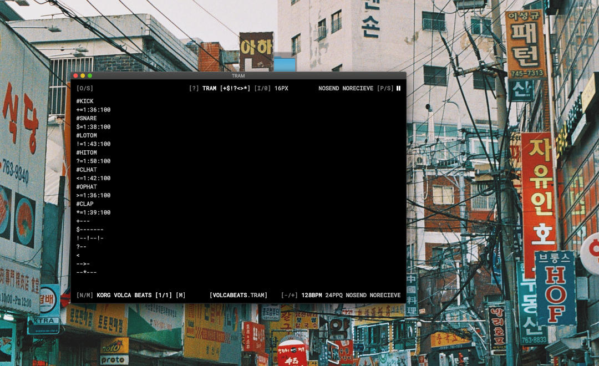
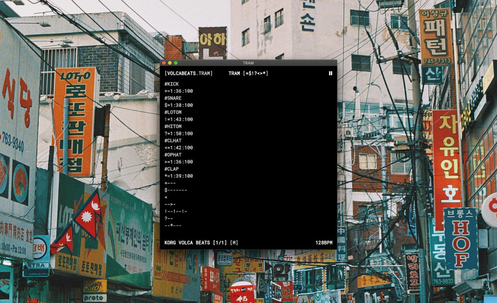

# TRAM

TRAM is short for Typographic Rythm Automation Machine and is a experimental MIDI sequencer. Map a midi message to a symbol, map a set of symbols to another symbol, combine symbols into bars, combine bars into beats.

TRAM features a minimalistic UI, autosave and immediate code evaluation so it's made for livecoding.



*Wide UI*



*Narrow UI*

## Installation

There are three ways to use TRAM. Either install a build for your platform from itch.io: [acidatm.itch.io/tram](https://acidatm.itch.io/tram)

Or run it within electron.js

```
git clone
cd tram/app
npm install
npm start
```

Or build a build of your choice with electron forge

```
git clone
cd tram/app
npm install
npm run build_osx
```

You can run any of these build commands

```
build_osx -> Mac OS
build_win -> Windows
build_linux -> Non Debian Linux
build_deb -> Debian Linux
```

## Usage

Every line you enter into the main interface will either be interpreted as a mapping or as a bar. If the line contains a `=` it will be treated as a mapping, otherwise TRAM will try to interprete it as a bar.

You can open and save files from the menu or using shortcuts. The current state of the editor is automatically saved whenever you change anything so there is no need to backup anything.

You can use *Cmd/Strg+C*, *Cmd/Strg+V*, *Cmd/Strg+A*and *Cmd/Strg+Z* in the editor.

You can change the filename by clicking between the two square brackets in the bottom center of the UI. The new filename will be used when you save the next time.

You can change the fontsize from the menu or using shortcuts.

Using *Window/Help* or *Cmd/Strg+?* will display a super short help popup. You need to close it the same way.

### Mapping

The left side of the `=` is the symbol the right side will be mapped to. You can map to single characters but also words. Sentences are not possible. Any symbol that is not mapped to anything will simply be interpreted as a break (like the `-` in the example below).

```
* = 128:0:127 -> valid
KICK = 128:0:127 -> valid
KICK DRUM = 128:0:127 -> invalid
```

You can also map a symbol or word to a bar. Simply write the desired bar on the right side of the `=`:

```
* = 1:C4:127
< = 1:D4:100
> = 1:E4:127
BASE = *---
HATS = <<><
```

The mapping needs to follow a certain convention. The part behind the `=` will be split by any of these separators:

- empty space

-  commata
- dot
- minus
- vertical line
- double point

The first part will be the midi message, the second and third part become the data bytes (see this table for reference: https://www.midi.org/specifications-old/item/table-2-expanded-messages-list-status-bytes).

You may use shorthands. By typing a number between 1 and 16 as the midi message you will send a note on command on the corresponing channel. You can also type notes and octaves instead of a number in the first data byte. These two midi messages are equivalent:

```
128:40:127
1:d4:127
```

Note off commands are sent automatically whenever you send a note on command. The note off command is sent right before the note on command. You can send additional note off commands manually, for example when you want a note to be held short then until the next note.

You can find some default mappings in the `/defaults` folder of the git repo.

### Programming

TRAM will try to interprete every line that is not a mapping as a bar. The amount of symbols in the line determine the length of the bar. Bars are resolved to 16th notes so when a line contains 16 symbols (or words) it will result in a bar that is actually a bar long (4 quarter notes). Bars are looped regardless of their length, so it's very easy to build polyrythms.

You can mix and match symbols and words but you need to divide them using spaces:

```
* = 128:0:127
KICK = 128:0:127
KICK * KICK -> valid
KICK*KICK -> invalid
```

You can comment out lines using the `#` symbol right at the start of the line

### Midi

TRAM sends Midi data to a single device and will also only recieve Midi data from this device. You can look for Midi devices with *Midi/Refresh* from the menu or using *Cmd/Strg+M* as shortcut. The list of all midi devices will be displayed in the bottom left corner of the UI. You can use the functions from the *Midi* menu or the shortcuts *Cmd/Strg+Shift+M* and *Cmd/Strg+Shift+N* to switch between devices.

TRAM can send and recieve Midi clock and Midi transport messages. You can toggle these from the *Midi* menu.

You can change the tempo and control the transport from the *Transport* menu or using shortcuts.

## Releases

Below you can find release notes on all major releases that had a dedicated build available. Look into the devlog over at [acidatm.itch.io/tram](https://acidatm.itch.io/tram) for more details.

- **0.1.0** Release of the initial alpha version

Feel free to send more default mapping to me or add them as a pull request.