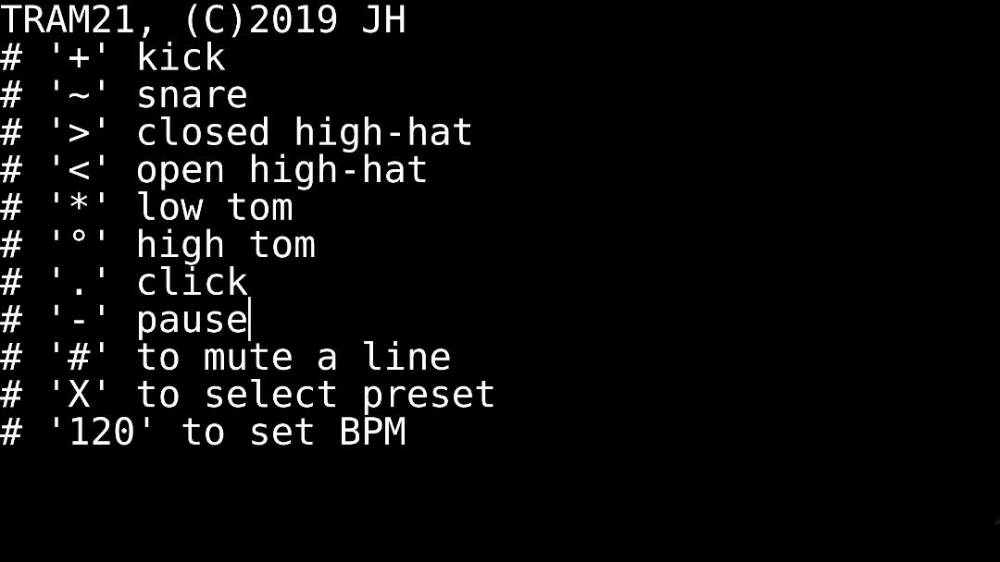
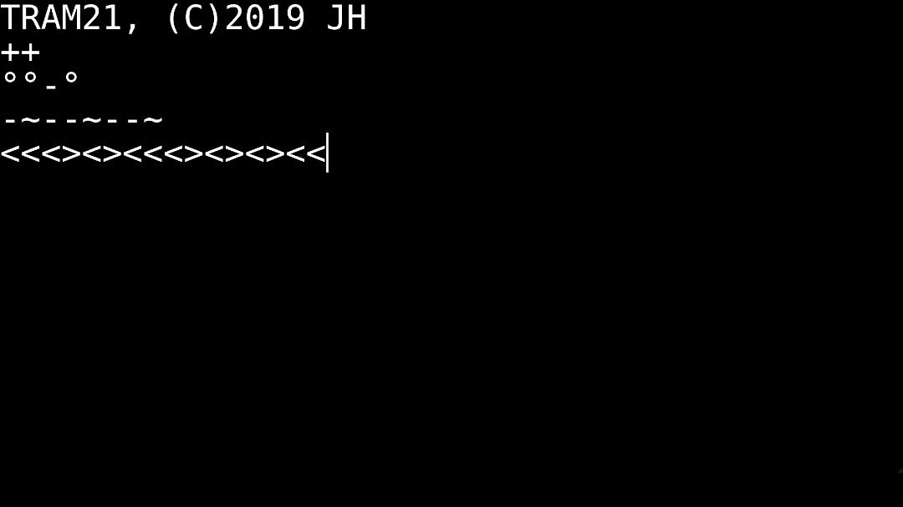

# TRAM

TRAM is short for Typographic Rythm Automation Machine and is a experimental MIDI sequencer. Map a midi message to a symbol, map a set of symbols to another symbol, combine symbols into bars, combine bars into beats. TRAM features a minimalistic UI, autosave and immediate code evaluation so it's perfect for livecoding performances.


*Wide UI*


*Narrow UI*

TRAM got it's name from a typographic sample based drumcomputer I wrote in 2019. I had the idea while taking the  tram. This how the original looked like:





## Installation

There are three ways to use TRAM. Either install a build for your platform from itch.io: [softboydev.itch.io/tram](https://softboydev.itch.io/tram)

Or run it within electron.js

```
git clone https://github.com/softboydev/tram.git
cd tram/app
npm install
npm start
```

Or build a build of your choice with electron forge

```
git clone https://github.com/softboydev/tram.git
cd tram/app
npm install
npm run build_osx
```

You can run any of these build commands

```
build_osx -> Mac OS
build_win -> Windows
build_all -> Builds for both platforms
```

## Usage

Every line you enter into the main interface will either be interpreted as a mapping or as a bar.

You can open and save files from the menu or using shortcuts. The current state of the editor is automatically saved whenever you change anything so there is no need to backup anything.

You can use *Cmd/Strg+C*, *Cmd/Strg+V*, *Cmd/Strg+A*and *Cmd/Strg+Z* in the editor.

You can change the filename by clicking between the two square brackets in the bottom center of the UI. The new filename will be used when you save the next time.

You can change the fontsize from the menu or using shortcuts.

Using *Window/Help* or *Cmd/Strg+?* will display a super short help popup. You need to close it the same way.

### Mapping

Mapping is one of the two key features. With mapping I am referring to the action of connecting a character or word to either a set of other characters or a MIDI message.

Mapping can be done either in the main window or in the dedicated mapping window. The terminal window allows no mapping.

The way a character or word is mapped is very simple. Every line that contains at least two words (a single character is treated as a word as well) is eligible for mapping. The first word (seperated by the space) is what the command is mapped to and the second word is the command. All other words in the line are treated normally and the two first words are ignored for anything but the mapping.

You can map letters, numbers and special characters to MIDI

```
K 128:36:100
3 129:39:127
+ 130:45:60
```

You can also map whole words to MIDI

```
KICK 128:36:100
SNARE 129:39:127
CLAP 130:45:60
```

You can map a word or character to a set of characters (not a set of words though!)

```
/ KKKK
BEAT KSKS
```

You can map characters to words and then a word to a set words

```
A KICK
B SNARE
C CLAP
BEAT ABCBCABC
```

The mapping needs to follow a certain convention. The second word can be split by any of these separators:

- empty space
- commata
- dot
- minus
- vertical line
- double point

The first part will be the midi message, the second and third part become the data bytes (see this table for reference: https://www.midi.org/specifications-old/item/table-2-expanded-messages-list-status-bytes).

You may use shorthands. By typing a number between 1 and 16 as the midi message you will send a note on command on the correspoding channel. You can also type notes and octaves instead of a number in the first data byte. These two midi messages are equivalent:

```
128:40:127
1:d4:127
```

Note off commands are sent automatically whenever you send a note on command. The note off command is sent right before the note on command. You can send additional note off commands manually, for example when you want a note to be held short then until the next note.

You can find some default mappings in the `/defaults` folder of the git repo.

#### Words and Characters

One of the interesting aspects of TRAM is how any combination of character can be mapped to any command. But this can also lead to a lot of confusion.

Let's say your drumcomputer has the kick on the first MIDI channel. In that case the following string would send kick with a pitch of C3 and velocity of 100

```
1:36:100
```

Now if you would want a kick to sound whenever you type the letter K you would write

```
K 1:36:100
```

The space after the letter maps the MIDI command to the letter. When you now type out KKK you would get a four to the floor pattern. Now lets say you would want to save that pattern to a new operator called TECHNO, then you would type

```
K 1:36:100
TECHNO KKKK
```

If you now type TECHNO you would hear a four the floor pattern. But what if you would also map the character T to a snare like this?

```
K 1:36:100
TECHNO KKKK
T 2:36:100
```

In that case the previous mapping of TECHNO would overwrite the mapping of T whenever the full word is spelled out, but as soon as you either type only T or any word containing the letter T that is not mapped you would instead hear the snare.

This creates a kick snare requireUpdateAfterMapping

```
K 1:36:100
TECHNO KKKK
T 2:36:100
KTKT
```

While this would create a polyrythmic snare pattern layered over the four to the floor pattern

```
K 1:36:100
TECHNO KKKK
T 2:36:100
TECHNO
TECHN
```

However once you type a word containing the subword TECHNO you would instead get a shifted kickpattern

```
K 1:36:100
TECHNO KKKK
T 2:36:100
TECHNOLOGY
```

Now what happens when we start typing full sentences like TECHNO IS COOL?

```
K 1:36:100
TECHNO KKKK
T 2:36:100
TECHNO IS COOL
```

TECHNO is being interpreted as four kicks while IS COOL has no mapping so its just left out. However we could map COOL to a snare pattern like this

```
K 1:36:100
TECHNO KKKK
T 2:36:100
TECHNO IS COOL
COOL TTT
```

Notice how nothing changes? That is because new mappings are added line by line. We have to map COOL before we use it, like this

```
K 1:36:100
TECHNO KKKK
T 2:36:100
COOL TTT
TECHNO IS COOL
```

Now what happens if we replace TECHNO with HOUSE? Remember: when a line contains a space the first two words are treated as a mapping, regardless of how many words are in the line. TECHNO IS COOL did work because TECHNO was already mapped, so the first two words in the line were not interpreted as a mapping. HOUSE is not mapped yet. So what will HOUSE be mapped to?

```
K 1:36:100
TECHNO KKKK
T 2:36:100
COOL TTT
HOUSE IS COOL
```

Right now you can only hear the snare pattern from COOL. Because HOUSE is now mapped to IS. When we give IS a mapping, HOUSE will be mapped to the mapping of IS. So lets make IS five kicks like so

```
K 1:36:100
TECHNO KKKK
T 2:36:100
COOL TTT
IS KKK
HOUSE IS COOL
```

Now why do we still hear the same? That is because we have only mapped HOUSE to IS. We havent used HOUSE yet. But when we type an extra line using HOUSE we will get a new pattern (because HOUSE is now mapped therefore the new line containing it is not interpreted as a mapping anymore)

```
K 1:36:100
TECHNO KKKK
T 2:36:100
COOL TTT
IS KKK
HOUSE IS COOL
HOUSE IS LIFE
```

Now you can hear the kicks from HOUSE and from IS. When we replace IS by WAS we only hear the 5 five kicks from HOUSE

```
K 1:36:100
TECHNO KKKK
T 2:36:100
COOL TTT
IS KKK
HOUSE IS COOL
HOUSE WAS LIFE
```

Now what happens when a word is not mapped to anything but parts of it are? Lets give F and E a sound like so (assuming clave and clap are on channel 3 and 4)

```
K 1:36:100
F 3:36:100
E 4:36:100
TECHNO KKKK
T 2:36:100
COOL TTT
IS KKK
HOUSE IS COOL
HOUSE WAS LIFE
```

Notice how the pattern changed as previously ignored characters now have a mapping? Lets clear all other lines that are not mapping and just write HOUSE IS LIFE (we just remove the COOL)

```
K 1:36:100
F 3:36:100
E 4:36:100
TECHNO KKKK
T 2:36:100
COOL TTT
IS KKKKK
HOUSE IS
HOUSE WAS LIFE
```

Right now you can hear one clave and one clap. If we now map LI to something as well the pattern changes

```
K 1:36:100
F 3:36:100
E 4:36:100
TECHNO KKKK
T 2:36:100
COOL TTT
IS KKKKK
LI FFE
HOUSE IS
HOUSE WAS LIFE
```

Now LIFE becomes a complex clap and clave pattern due to LI being mapped to a pattern and F and E being mapped to a specific MIDI note. But what happens if we now also map the whole word as well like this?

```
K 1:36:100
F 3:36:100
E 4:36:100
TECHNO KKKK
T 2:36:100
COOL TTT
IS KKKKK
LI FFE
HOUSE IS
LIFE IS
LIFE
```

We now hear five kicks even though LI and F and E are mapped before the whole word was mapped. That is because mappings happen in order of the lines, so they are only available in the lines after. But once they have happened mappings are sorted by their length. Which means: we check if LIFE has been mapped before we check if any of its parts have been mapped.

#### Recursion

One final thing. You can map words to themselves, lets call it recursive mapping. To not crash your computer I have decided to limit recursion to a depth of 10. What does recursion do exactly? Image this:

```
A 1:36:100
B 2:36:100
C 4:36:100
AB
```

A is a kick and B is a snare. AB will result in a kick and snare pattern with the kick on the 1 and snare on the 3. If we now map AB to something else instead (like C) and type it out in another line we only hear the clap, because the mapping of the word AB overwrites the individual mappings of the characters A and B

```
A 1:36:100
B 2:36:100
C 4:36:100
AB C
AB
```

But see what happens if instead map the word AB a word that contains the word AB again?

```
A 1:36:100
B 2:36:100
C 4:36:100
AB ABC
AB
```

We hear a lot of claps suddenly. That is because internally every occurence of AB is replaced with ABC. But we dont do only one round. After a round of replacements has happened we do another one and again replace every occurence of AB with ABC. This place an additional C in the line with every round. You hear 10 extra claps because recursion is limited to 10. But you can go wild with this concept by creating complex mapping networks

```
A 1:36:100
B 2:36:100
C 3:36:100
D 4:36:100
AB ABC
BC ADB
ADB ABCD
AB
```

Now only typing out AB will result in an insanely complex pattern.

### Programming

TRAM will try to interprete every line that is not a mapping as a bar. The amount of symbols in the line determine the length of the bar. Bars are resolved to 16th notes so when a line contains 16 symbols (or words) it will result in a bar that is actually a bar long (4 quarter notes). Bars are looped regardless of their length, so it's very easy to build polyrythms.

If a line contains more then 16 commands the line is interpreted as more then one bar. One additional bar is added for each full set of 16 commands.

Unmapped characters are treated as a pause, so can use unmapped characters to shift steps around by extending the pattern length without adding additional commands.

This will result in a clap on the 1

```
C
```

This will result in a snare on the 1 and the 3

```
C
SS
```

This will result in a four to the floor pattern with a snare on every second kick

```
C
SS
KKKK
```

This will add 16th notes hihats

```
C
SS
KKKK
HHHHHHHHHHHHHHHH
```

Now if we want the clap to be on the last kick in the pattern instead of the first we simply add 3 unmapped characters before it

```
---C
SS
KKKK
HHHHHHHHHHHHHHHH
```

Lets add an open hat on the upbeat

```
---C
SS
KKKK
HHHHHHHHHHHHHHHH
-O-O-O-O
```

Now lets break out from the rigid pattern by adding a lo-tom, a hi-tom and a rimshot pattern

```
---C
SS
KKKK
HHHHHHHHHHHHHHHH
-O-O-O-O
LLL
TTTTT
R-RR-RR
```

You can comment out lines using the `#` symbol right at the start of the line. So lets prepare the pattern for the drop

```
---C
SS
#KKKK
HHHHHHHHHHHHHHHH
-O-O-O-O
LLL
TTTTT
R-RR-RR
```

### Midi

TRAM sends Midi data to a single device and will also only recieve Midi data from this device. You can look for Midi devices with *Midi/Refresh* from the menu or using *Cmd/Strg+M* as shortcut. The list of all midi devices will be displayed in the bottom left corner of the UI. You can use the functions from the *Midi* menu or the shortcuts *Cmd/Strg+Shift+M* and *Cmd/Strg+Shift+N* to switch between devices.

TRAM can send and recieve Midi clock and Midi transport messages. The clock can be switch between 24 and 48ppq and between and internal and an external clock. You can toggle these from the *Midi* menu. Please note: clock recieval is *very* wonky right now, I am sorry.

You can change the tempo and control the transport from the *Transport* menu or using shortcuts.

### Windows

The main window allows you too map, program and set the settings from a UI. However sometimes, especially when you have a lot of complex mappings that you dont need to interact with ofter, you might want to unclutter your main window. For that I have added the *Mapping Window*. Open it from the menu `Window > Open Mapping Window` or use the shortcut `Cmd+M`. The content of the mapping window is only interpreted as mappings, never as commands, so you can type here without disturbing a running pattern.

For when you want to type freely without having to worry about accidentally overwriting a mapping or when you just want people to type in whatever I have added a *Terminal Mode*. It is displayed (on the big screen) in the top center, otherwise its available from the menu `Window > Set Terminl Mode To`. These are the three modes available

- `Terminal:All` - Allows mapping of MIDI and words from the editor
- `Terminal:Words` - Only allows mapping of words but not of MIDI (so `BEAT ABAB` is valid while `A 1:C3:100` is not)
- `Terminal:None` - Allows no mappings at all

The mappings done in the Mapping window are not affected by this setting. Lines that would have been mapped in another are treated as regular inputs when they are not mapped (in the mode `Terminal:Words` the line `A 1:C3:100` would map the `A` character to the word or character combination consisting of `1`,`:`,`C`,`3` and `0`)

## Releases

Below you can find release notes on all major releases that had a dedicated build available. Look into the devlog over at [softboydev.itch.io/tram](https://softboydev.itch.io/tram) for more details.

- **0.1.0** Release of the initial alpha version
- **0.1.1** Fixed a bug that would make switching between MIDI devices impossible
- **0.2.0** Switched to the original quanitsation again
- **0.3.0** Improved pattern generation, new mapping window, new terminal mode and word interpretation
  - You can now set the editor to different modes that only allows editing of the pattern, no new mappings are possible
  - You can now open a mapping window where you can create mappings that are not visible in the main window and also dont interfere with your playback pattern
  - TRAM is now capable of mapping whole words and sentences instead of only single characters. TRAM will even find words contained within other words, so you can map TECHNO to a four to the floor pattern and then write out TECHNOLOGY

## Known Issues

- Currently there is no Linux package available
- Many keyboard shortcuts do not work on Windows

## Future Plans

- Fixing known issues
- Adding a settings window to set colors and defaults
- Adding OSC capabilites
- Improving MIDI implementation, especially clock recieval
- Adding an optional graphic interface for the mapping window
- Adding performance features such as block comments and timed comments that become uncommented after a certain number of bars

## Participation

If you find any bugs feel free to send me an email or open an issue. Also feel free to send more default mapping to me or add them as a pull request.
